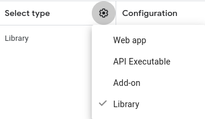
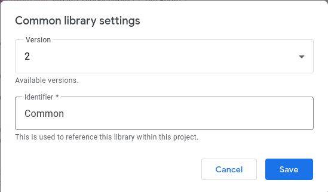

# Auto-LaTeX-Equations

Auto-LaTeX Equations add-on for Google Docs

## Setup

You need to get the .clasp.json files within Docs/, Slides/, and Sheets/ by dm'ing Aayush.

clasp is used to sync your local folder with the actual code sandbox in the Google Doc/Slide/whatever that's eventually published. We use Github for development with multiple people. You can use clasp to live update the code in the Google sandbox so you dont have to deal with push/pull anymore. More info at https://www.toptal.com/google-docs/extending-google-sheets-app-scripts.

For the Common library, you can use `clasp push -w` to watch for changes and push them to this library. Dependent Apps Script projects will automatically use the development version of the library.

For any projects which depend on the Common library (Slides and Docs), the Common project ID must be added to the manifest file. The `LibraryLinker` script does this for you, and is called when using the `clasp-push` NPM script in Slides and Docs. (This script links the library, runs `clasp push`, then unlinks the library.)

Therefore, to push changes to Slides and Docs, instead of using `clasp-push`, use `npm run clasp-push` in the respective directory, or use the workspace name in the root directory. (e.g. `npm -w Slides run clasp-push`)

If you would like to watch for changes, `npm -w Slides/Docs run clasp-push -- -w` will pass the `-w` flag to `clasp push`.

**However**, `Ctrl+C`'ing the watch will not run the `postclasp-push` script, meaning the Common library will stay linked to the dependent project. To fix this, run `npm -w Slides/Docs run postclasp-push` after stopping the watch.

## Types

Types are built with an updated version of `clasp-types`.

To build the types for either the Common library, Slides, or Docs run `npm -w Common/Slides/Docs run build-types`. This will build the types into the `types/` directory.

To build the types for all three, run `npm -ws run build-types`.

## Sidebar Files

> **Note**
> These files will be removed once the addon is completely upgraded to the new Google Workspace style. As of right now, Google offers no way to automatically upgrade users to this new style.

To get types for google.script.run, the sidebar JS must be contained in its own JS file. When the `clasp-push` script is run, `sed` will copy the contents of this to `SidebarJS.html`. Therefore, don't edit `SidebarJS.html` directly unless you know what you're doing.s

## Deployment

### Common Library

1. Ensure `.clasp.json` points to the production script project (the script ID should match the one in the URL bar on `script.google.com`)
2. Set `DEBUG` to `false` in Code.ts
3. Run `clasp push`
4. Open the project on `script.google.com` (Auto-Latex Equations: Common library)
5. Click Deploy -> New deployment
6. Select the "Library" type
   
   
7. Enter a description for the deployment. This should be of the form `commit hash: commit message` for consistency
8. Click deploy. It should tell you what version you just created.

### Editor Add-ons

1. Run `npm run clasp-push` to push while linking to Common (this will link to the development version)
1. Open the project on `script.google.com`, and switch to the Code tab
1. In the Code sidebar on the left, click the Common library (just click "Common", don't click the 3 dots)
   
   
1. Switch the version to the one you just created
   
   
1. Click Deploy -> Manage Deployments
1. Click the edit button
1. Click the version dropdown and select "New version"
   
1. Enter a description (same format as Common description)
1. Click deploy. It should tell you what version you just created.
1. Open [App Configuration](https://console.cloud.google.com/apis/api/appsmarket-component.googleapis.com/googleapps_sdk) in GCP, and scroll down to "App Integrations"
1. Update the "script version" to the version you just created
   
   
1. Click Save Draft at the bottom
1. Switch to "Store Listing" and click Publish at the bottom

Wait about 10 minutes for changes to propagate

### Cleanup (optional - after publish succeeds)

1. Go to Deploy -> Manage Deployments for all script projects
2. Click the archive button for all old deployments

## Helpful documentation pages for Slides

[class selection](https://developers.google.com/apps-script/reference/slides/selection)

[selecting items within presentation](https://developers.google.com/apps-script/guides/slides/selecting)

[get position](https://developers.google.com/apps-script/guides/slides/moving-elements)

## Remaining Tasks

To fix slides issues with tables etc: https://docs.google.com/document/d/1ekcCbx1lWtJ--9eprOD0fgfO2YGr2vNn1WzkxTLzpFg/edit?usp=sharing
