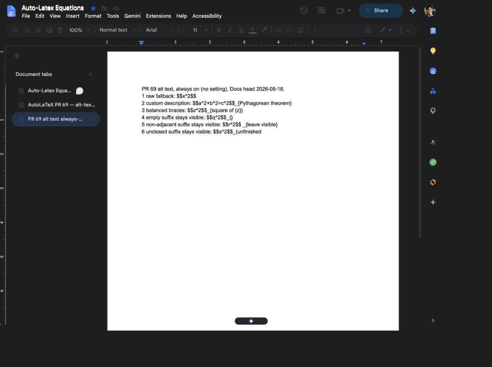
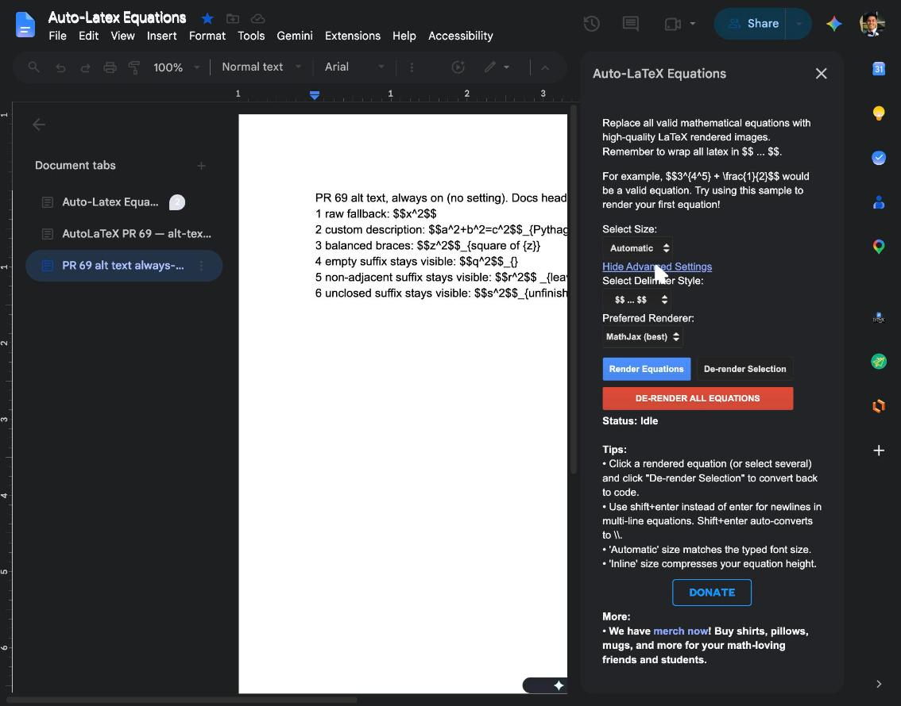
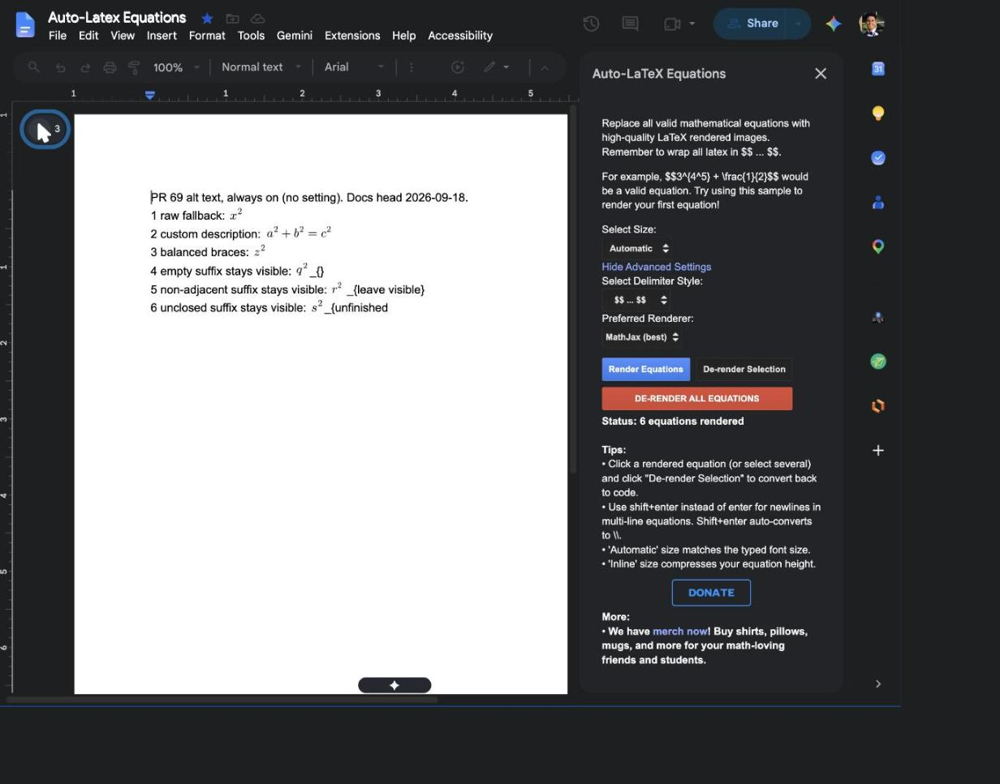
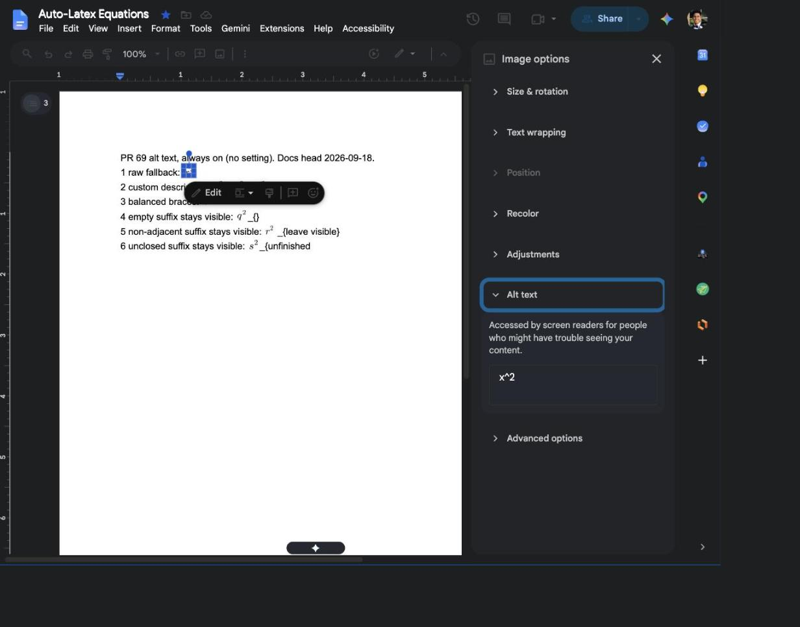
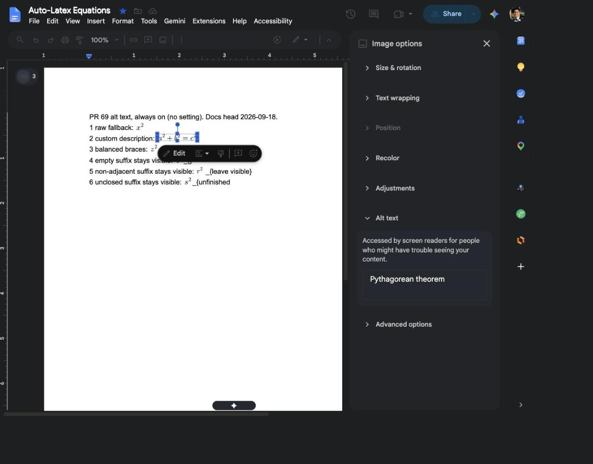
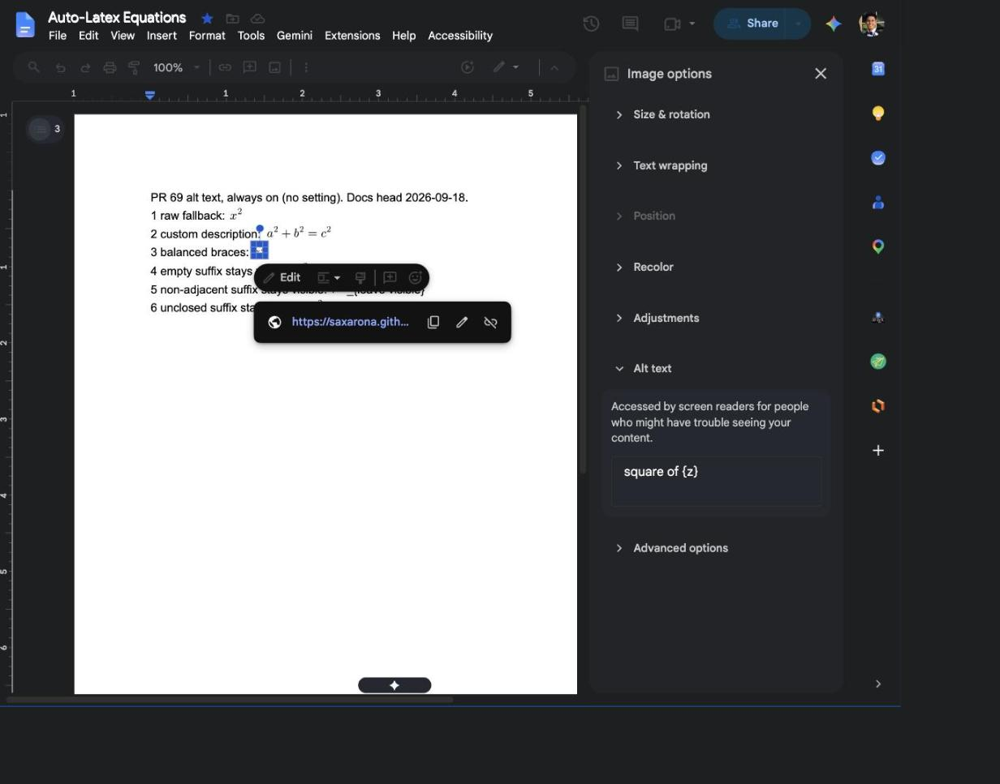
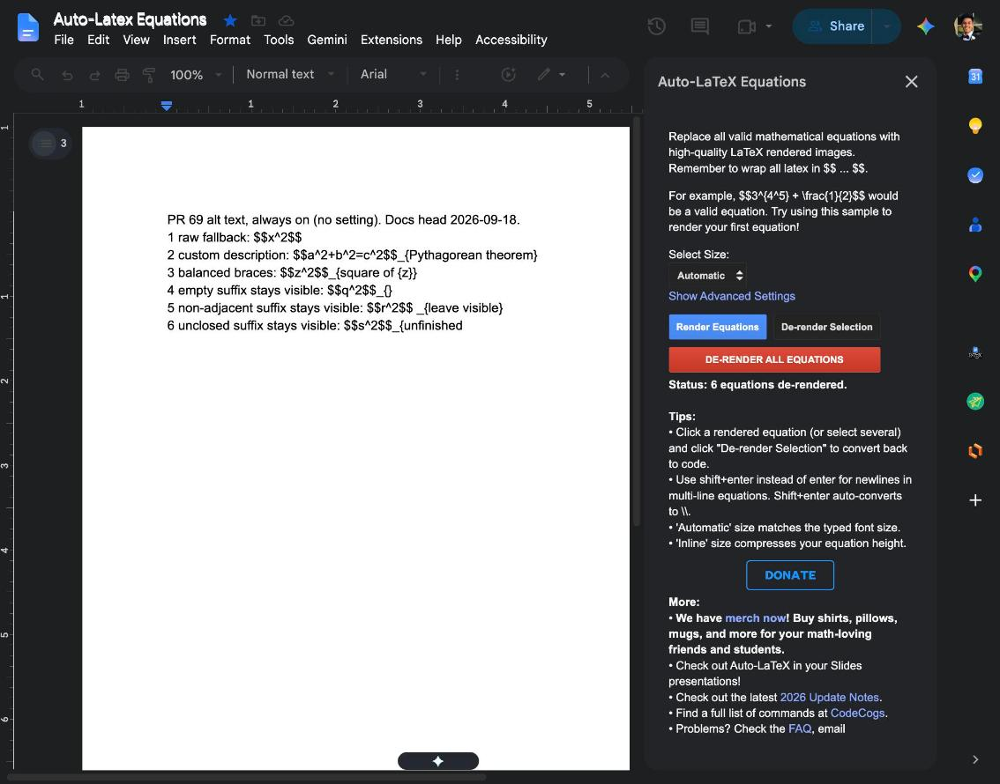

# PR #69 live Docs evidence — alt text, always on

Captured 2026-09-18 in Google Docs, against this branch's Docs code pushed to the
Docs Apps Script **project head** (Common pinned to v8, `developmentMode: false`;
pulled back and verified byte-identical to what was pushed). The Docs Marketplace
release stays v95 — nothing here is published to users.

These replace the screenshots in the PR's 2026-09-15 comment. Those were taken
against the earlier opt-in revision and show an "alt text" checkbox that no
longer exists. Work happened in a new document tab so the earlier QA content and
the rest of the document were left untouched.

## Fixtures

Six cases in one tab, covering the whole `_{description}` rule:

```
1 raw fallback: $$x^2$$
2 custom description: $$a^2+b^2=c^2$$_{Pythagorean theorem}
3 balanced braces: $$z^2$$_{square of {z}}
4 empty suffix stays visible: $$q^2$$_{}
5 non-adjacent suffix stays visible: $$r^2$$ _{leave visible}
6 unclosed suffix stays visible: $$s^2$$_{unfinished
```



## There is no setting any more



Advanced Settings now holds only Delimiter Style and Preferred Renderer. Alt text
is not a choice the user has to find and turn on.

## Rendered



`Status: 6 equations rendered`. Cases 2 and 3 consumed their `_{...}` suffix;
cases 4, 5 and 6 left theirs visible in the document, exactly as authored.

## What a screen reader gets

Read out of Google's own Image options → Alt text panel, not from our code.

| Case | Alt text |
| --- | --- |
| `$$x^2$$` |  |
| `$$a^2+b^2=c^2$$_{Pythagorean theorem}` |  |
| `$$z^2$$_{square of {z}}` |  |

Case 1 falls back to the raw source `x^2`. Case 2 uses the authored description.
Case 3 keeps the inner braces, so nested `{}` in a description survives.

## Round trip



`Status: 6 equations de-rendered`, and all six lines come back character for
character — including `_{Pythagorean theorem}` and `_{square of {z}}`, which were
consumed at render time, and the three suffixes that were deliberately left
alone. Nothing is duplicated and nothing is lost.
