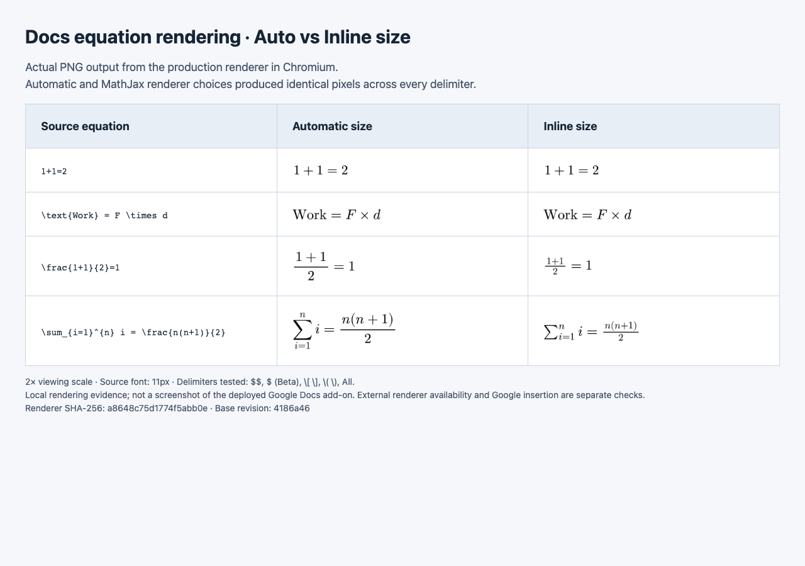
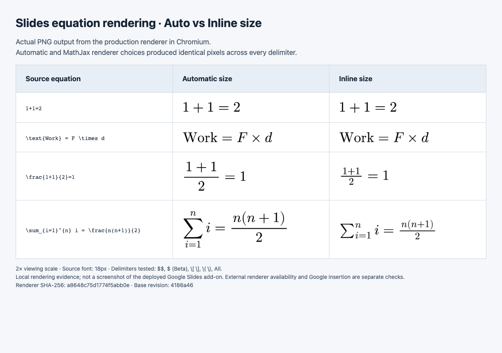
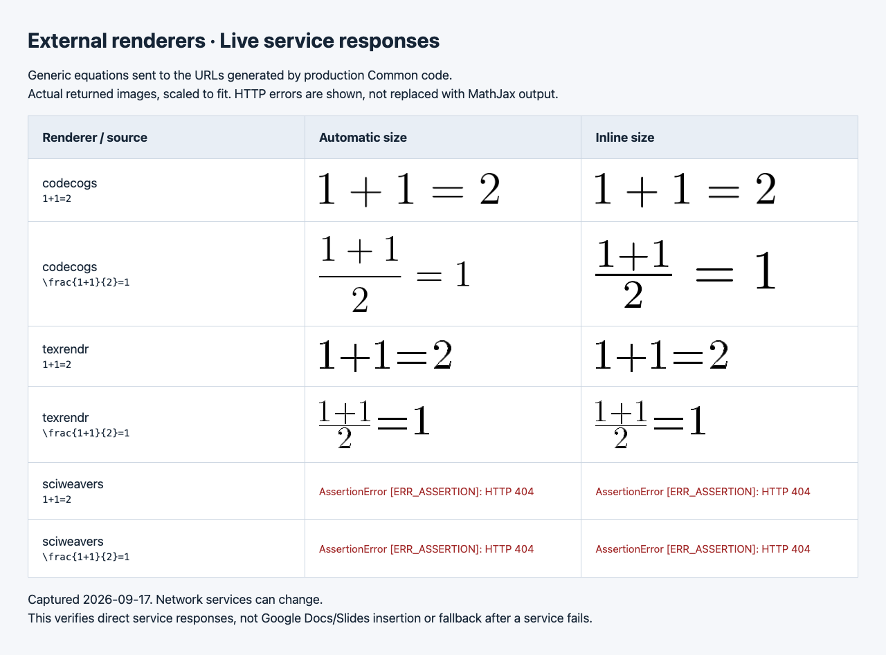

# PR #71 rendering evidence

Captured 2026-09-17 using the committed browser scripts in this PR. These are
**actual rendered PNGs shown in a local review gallery**, not screenshots of a
Google document or a deployed add-on. Generic equations only.

The MathJax renderer source is unchanged from `4186a46` and identified by its
SHA-256 in each screenshot and the CI JSON artifact. Every subsequent PR run
uploads fresh screenshots and per-combination records in the `render-matrix-*`
GitHub Actions artifact. See [suite instructions and limits](../../README.md).

## Docs: Automatic and Inline sizes

## Slides: Automatic and Inline sizes

The browser suite checks all 40 Automatic/MathJax renderer × delimiter × size ×
app combinations. Four samples, including all four members of the mixed `All`
selector, produce 256 PNG renders. Complete glyphs, visible pixels and Inline
fraction/sum compaction pass. Delimiter/preference variants have identical PNG
hashes for the same app, equation and size. The pre-fix renderer fails on Inline
`1+1=2` with three SVG fragments instead of one.

## External services: live responses

The separate live probe tries the 60 external-renderer combinations with two
samples. Repeated URLs share responses, yielding 12 distinct service requests.
Codecogs and Texrendr returned the complete equations shown above. Sciweavers
returned **HTTP 404** in both modes for both samples; the probe exits nonzero.
No claim is made that Sciweavers works or that these live results are permanent.
This checks the preferred service endpoint; fallback after an outage and Google
image insertion are outside this smoke test.
