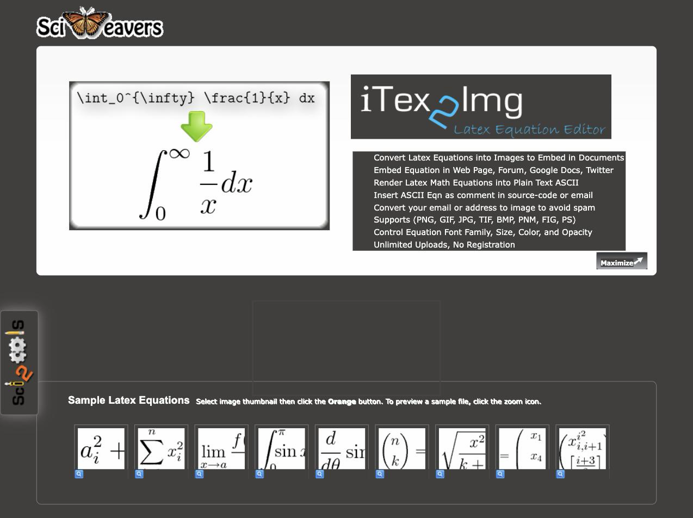
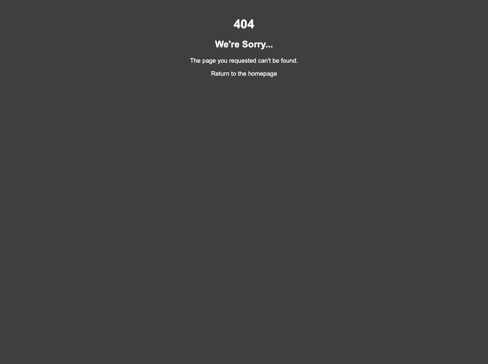
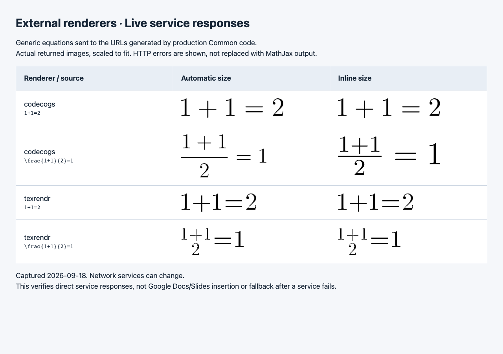

# Sciweavers: what is actually broken

Captured 2026-09-18, from this branch. This directory answers a specific
objection to PR #71's live-probe result — "Sciweavers returns HTTP 404, but the
website clearly still loads." Both halves of that are true. They are about
different things.

## sciweavers.org is up

`https://www.sciweavers.org/free-online-latex-equation-editor` returns HTTP 200
and its Tex2Img editor works. Nothing here suggests the site is down.

## The endpoint AutoLatex uses is gone

Every Sciweavers entry in `Common.getRenderer` is built on `tex2img.php`, a GET
URL that returns the image directly. That file now returns the site's own 404
page. Checked 2026-09-18:

| Variation tried | Result |
| --- | --- |
| `https://www.sciweavers.org/tex2img.php?bc=…&eq=…` (our URL) | 404 |
| `…?eq=…&bc=…` (the order sciweavers' own editor emits) | 404 |
| `http://` (301s to `https://`), apex `sciweavers.org` | 404 |
| curl, Chrome, Googlebot and Apps-Script-shaped user agents | 404 |
| With a session cookie and a Referer from the editor page | 404 |
| `/tex2img.php` with no query string at all | 404 |
| Real Chrome, screenshot above | 404 |

The site's working path is now a POST to `/process_form_tex2img`, which writes a
one-off image to `/upload/Tex2Img_<id>/render.png`. Two identical submits 3
seconds apart returned `Tex2Img_1789770006` and `Tex2Img_1789770009`: the id is
per-request and carries none of the LaTeX. AutoLatex de-renders an equation by
reading its source back out of the image URL, so a URL like that cannot replace
`tex2img.php` even though it produces a correct image.

Their editor still advertises a `tex2img.php` link as the embed URL after a
successful render. That link 404s too, which is most likely how this went
unnoticed on their end.

## After retiring the family

`npm run test:render-services` on this branch: **40 server settings, 8 distinct
live requests, 0 unavailable**, exit 0. On `master` the same probe made 12
requests and 4 failed. Nothing about Codecogs or Texrendr changed; the four dead
Sciweavers requests are simply no longer made, because the renderer is no longer
offered. `results.json` is the full run record.

Sciweavers indices 5, 7, 8 and 11 remain reachable through `getRenderer` and
`capableDerenderers`, so equations rendered before the shutdown still de-render —
`tests/retired-renderers.test.js` pins both halves of that.
